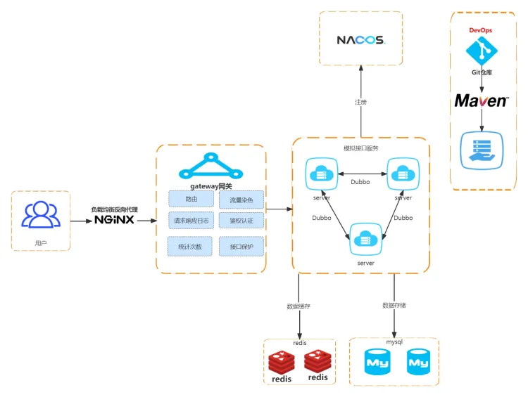

# API Platform

详细可点-》[项目笔记](https://www.yuque.com/guangjun-0q7tw/sy4yod/rvn0cyqy20u2cw8h)

## 项目设计


参考：搏天api

## 项目介绍
API Platforn ，提供后端 API 接口的平台，用户可以注册登录，调用接口。管理员可以发布接口，上线接口，接口管理，查看接口调用的可视化界面。

## 项目亮点
1. 使用 API 签名认证算法实现调用接口，防止非法用户进行不合理的调用接口，提高接口调用的安全性。
2. 开发客户端 SDK，通过注入客户端对象+配置文件一行代码就可调用接口。减少冗余代码。
3. 使用 gateway 网关实现用户鉴权，使用 Response 装饰器实现项目的业务逻辑，提高项目安全性。代码复用性等等。
4. 使用 Dubbo（RPC）+Nacos（注册中心）实现模块内方法的调用，提高代码的复用性。
5. 将项目设计为common，client，interface，gateway，basekend 五个模块，各司其职，架构清晰。

## 业务流程
管理员通过后端管理系统进行接口管理，发布上线接口，统计分析接口的调用情况。
用户通过前台界面浏览接口，调用接口。

具体流程如下图


## 技术选型

后端

* Spring Boot
* Spring boot Starter （SDK开发）
* Dubbo (RPC)
* Nacos 
* Spring Cloud Gateway (网关，限流，日志实现等)
* MySQL
* JDK8

## 数据库设计

```sql
-- 创建库
create database if not exists api;

-- 切换库
use api;

-- 用户表
create table if not exists user
(
id           bigint auto_increment comment 'id' primary key,
userName     varchar(256)                           null comment '用户昵称',
userAccount  varchar(256)                           not null comment '账号',
userAvatar   varchar(1024)                          null comment '用户头像',
gender       tinyint                                null comment '性别',
userRole     varchar(256) default 'user'            not null comment '用户角色：user / admin',
userPassword varchar(512)                           not null comment '密码',
accessKey    varchar(512)                          null comment 'accessKey',
secretKey    varchar(512)                          null comment 'secretKey',
createTime   datetime     default CURRENT_TIMESTAMP not null comment '创建时间',
updateTime   datetime     default CURRENT_TIMESTAMP not null on update CURRENT_TIMESTAMP comment '更新时间',
isDelete     tinyint      default 0                 not null comment '是否删除',
constraint uni_userAccount
unique (userAccount)
) comment '用户';

-- 接口信息
create table if not exists api.`interface_info`
(
`id` bigint not null auto_increment comment '主键' primary key,
`name` varchar(256) not null comment '名称',
`description` varchar(256) null comment '描述',
`url` varchar(512) not null comment '接口地址',
`method` varchar(256) not null comment '请求类型',
`requestHeader` text null comment '请求头',
`responseHeader` text null comment '响应头',
`requestParams` text not null comment '请求参数',
`status` int default 0 not null comment '接口状态（0-关闭，1-开启）',
`userId` bigint not null comment '创建人',
`createTime` datetime default CURRENT_TIMESTAMP not null comment '创建时间',
`updateTime` datetime default CURRENT_TIMESTAMP not null on update CURRENT_TIMESTAMP comment '更新时间',
`isDelete` tinyint default 0 not null comment '是否删除(0-未删, 1-已删)'
) comment '接口信息';

-- 用户调用接口关系表
create table if not exists api.`user_interface_info`
(
`id` bigint not null auto_increment comment '主键' primary key,
`userId` bigint not null comment '调用用户 id',
`interfaceInfoId` bigint not null comment '接口 id',
`totalNum` int default 0 not null comment '总调用次数',
`leftNum` int default 0 not null comment '剩余调用次数',
`status` int default 0 not null comment '0-正常，1-禁用',
`createTime` datetime default CURRENT_TIMESTAMP not null comment '创建时间',
`updateTime` datetime default CURRENT_TIMESTAMP not null on update CURRENT_TIMESTAMP comment '更新时间',
`isDelete` tinyint default 0 not null comment '是否删除(0-未删, 1-已删)'
) comment '用户调用接口关系';
```